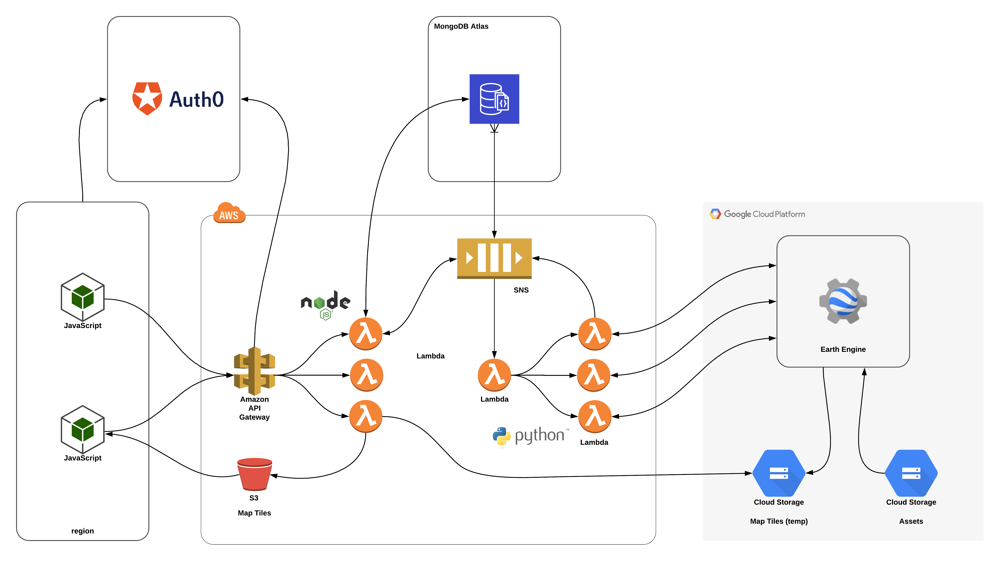

# Marapp API Services

Marapp API services and data processing pipeline, using [MongoDB Atlas](https://www.mongodb.com/cloud/atlas) and [Google Earth Engine](https://earthengine.google.com) for data computation.

## System architecture



Components:
- Amazon Lambda
- Amazon SNS/SQS
- Amazon S3
- MongoDB Atlas
- Amazon Elasticsearch Service 
- Amazon ElastiCache (Redis)
- Google Earth Engine

Pipeline components:
- [marapp-metrics](https://github.com/natgeosociety/marapp-metrics)
- [marapp-workers](https://github.com/natgeosociety/marapp-workers) (λ)

Required configuration:
- [MongoDB Atlas](docs/mongodb-atlas-configuration.md)
- [Auth0](docs/auth0-configuration.md)

## Setup

Available commands:

| Command                   | Description                    |
| ------------------------- | ------------------------------ |
| npm install               | Install dependencies.          |
| npm run build             | Compile TypeScript resources.  |
| npm run test              | Run all tests.                 |
| npm run typecheck         | Type checking.                 |
| npm run prettify          | Format code. (Prettier)        |
| npm run lint              | Lint code sources.             |
| npm run serverless:start  | Start the λ functions locally. |
| npm run serverless:deploy | Deploy the λ functions         |

## Running

The following environment variables are required by the application. For more details about obtaining them, see required configuration section.


| **Key**                       | **Description**                                                                  |
| ----------------------------- |----------------------------------------------------------------------------------|
| NODE_ENV                      | Environment stage.                                                               |
| MONGODB_URI                   | MongoDB Connection URI.                                                          |
| GOOGLE_SERVICE_ACCOUNT        | GCP Service Account Private Key.                                                 |
| REDIS_URI                     | Redis Connection URI.                                                            |
| ELASTICSEARCH_URI             | Elasticsearch Connection URI.                                                    |
| SERVICE_API_KEY               | API Key secret.                                                                  |
| SNS_TOPIC_MANAGER_ARN         | Topic ARN from [marapp-workers](https://github.com/natgeosociety/marapp-workers).|
| AUTH0_CLIENT_ID               | Auth0 M2M Client ID.                                                             |
| AUTH0_CLIENT_SECRET           | Auth0 M2M Client Secret.                                                         |
| AUTH0_DOMAIN                  | Auth0 Domain URL.                                                                |
| AUTH0_EXTENSION_URL           | Auth0 API access URL                                                             |
| AUTH0_APPLICATION_CLIENT_ID   | Auth0 Application Client ID                                                      |
| PUBLIC_ORG                    | The name of the public organzation (Auth0)                                       |

The required environment variables are also described in [.env.sample](.env.sample).

####  VPC Configuration

You can configure the functions to connect to private subnets in a virtual private cloud (VPC) in your account.

The following environment variables are required to connect to a VPC.
```shell script
VPC_SECURITY_GROUP_ID_1='<SECURITY-GROUP-ID1>'
VPC_SECURITY_GROUP_ID_2='<SECURITY-GROUP-ID2>'
...
VPC_SUBNET_ID_1='<SUBNET_ID1>'
VPC_SUBNET_ID_2='<SUBNET_ID2>'
...
```
For more details, see: https://www.serverless.com/framework/docs/providers/aws/guide/functions#vpc-configuration

Start required services. 

```bash
$ docker-compose -f docker-compose.yml up
```

Start the lambda functions locally.

```bash
$ npm run serverless:start
```

This will emulate the functions on your local machine for development. 

## Deployment

Create & deploy all required services. 

You will need an AWS access key ID and secret pair stored in `~/.aws/credentials`.

Alternatively, you can authenticate via the `AWS_ACCESS_KEY_ID` and `AWS_SECRET_ACCESS_KEY` environment variables.

You will need to have access to the following AWS services:
- CloudFormation

Create a local `.env` file based on [.env.sample](.env.sample), add the required configuration for the environment, and run:

```shell script
npm run deploy:serverless -- --stage <env>
```
OpenAPI Specification for all available endpoints can be found at: `/services/api/v1/docs/`

## Docs
- [Bootstrapping groups, roles & permissions.](docs/bootstrap-groups-roles-permissions.md)
- [Load fixture data.](docs/bootstrap-fixture-data.md)
